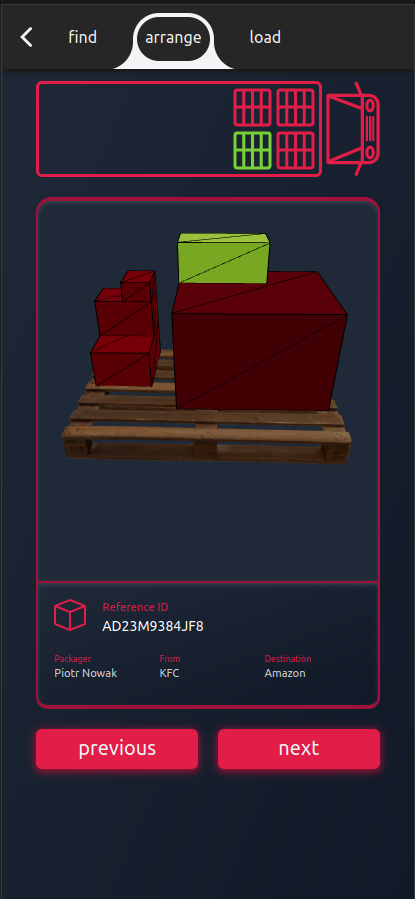

  

  

    Application that improves the work of a warehouseman
     
    <a href="https://github.com/jkowiesk/pack-it/issues">Report Bug</a>
  

### About The Project

    
 

The main objective of the hackathon was to delve into the concept of "Warehouse 4.0" and create a solution that could enhance the efficiency and organization of warehouse operations in 24 hours. Following extensive research, our team arrived at the decision to develop a web application, primarily for mobile devices, to better organize and optimize the work of warehouse personnel.

To help optimize every step of work, we divided the PackIT app into four sections:

- Order: Choosing the order to take.
- Find: A map with the path where to find packages.
- Arrange: How to arrange packages on a pallet and in which order with 3D visualization.
- Load: How to load pallets into a truck, including barcode scanning.

### Built With

- [![Svelte Kit][svelte-kit]][svelte-kit-url]
- [![Tailwindcss][tailwind-css]][tailwind-css-url]
- [![Three.js][three.js]][three.js-url]

(<a href="#readme-top">back to top</a>)

<!-- MARKDOWN LINKS & IMAGES -->

[svelte-kit]: https://img.shields.io/badge/Svelte_Kit-FF3E00?style=for-the-badge&logo=svelte&logoColor=white
[svelte-kit-url]: https://kit.svelte.dev/
[tailwind-css]: https://img.shields.io/badge/Tailwind_CSS-38B2AC?style=for-the-badge&logo=tailwind-css&logoColor=white
[tailwind-css-url]: https://tailwindcss.com/
[three.js]: https://img.shields.io/badge/Three.js-black?style=for-the-badge&logo=three.js&logoColor=white
[three.js-url]: https://threejs.org/
